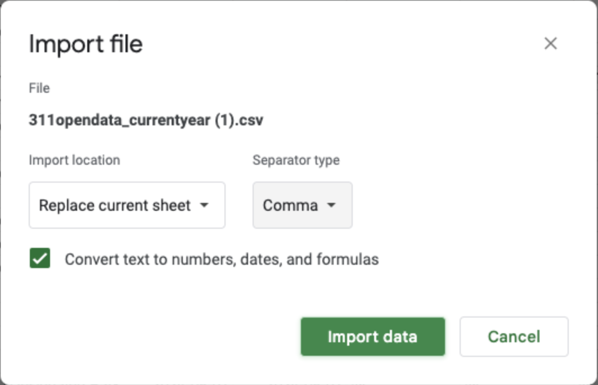
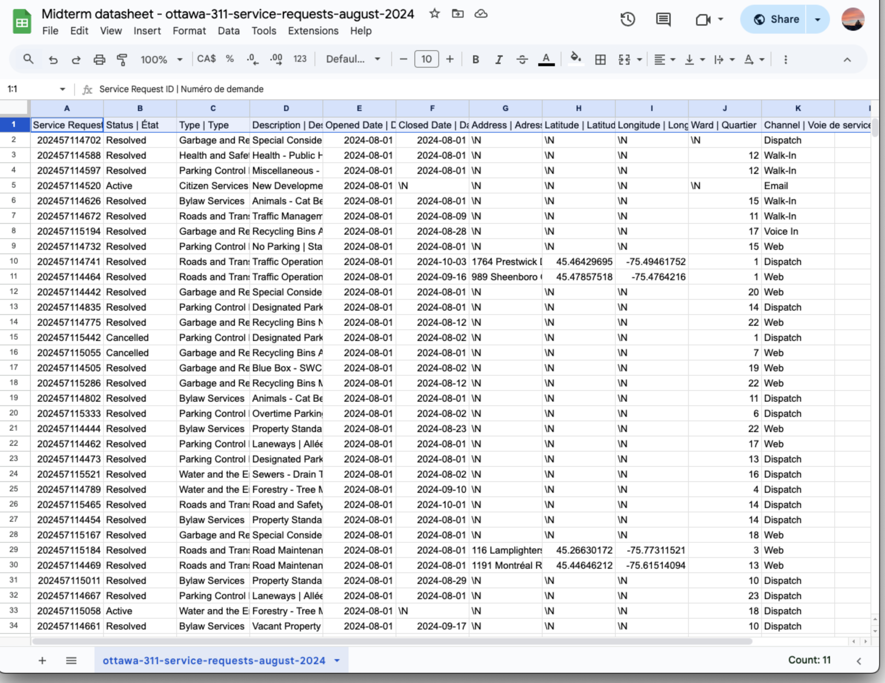
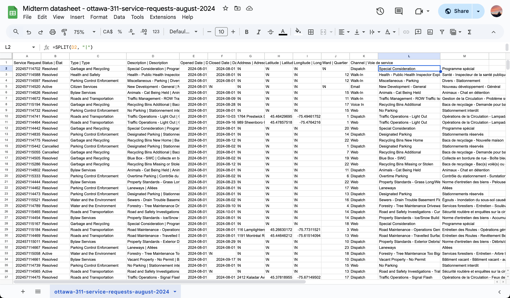

**Wed Oct 23**<br>
**MPAD2003A Introductory Data Storytelling**<br>
**Noor Choudhry**<br>
**Presented to Jean-Sébastien Marier**<br>

# Midterm Project: Exploratory Data Analysis (EDA)

## Foreword

For this assignment, you must extract data from a dataset provided by the instructor. You must then clean and analyze the data, create exploratory charts/visualizations, and find a potential story idea. Your assignment must clearly detail your process. You are expected to write about 1500-2000 words, and to include several screen captures showing the different steps you went through. Your assignment must be written with the Markdown format and submitted on GitHub Classroom.

I have been assigning different versions of this project to my digital journalism and data storytelling students for a few years now. Its structure was inspired by the main sections/chapters of [*The Data Journalism Handbook*](https://datajournalism.com/read/handbook/one/). This version was further inspired by the [Key Capabilities in Data Science](https://extendedlearning.ubc.ca/programs/key-capabilities-data-science) program offered by the University of British Columbia (UBC).

**Here are some useful resources for this assignment:**

* [GitHub's *Basic writing and formatting syntax* page](https://docs.github.com/en/get-started/writing-on-github/getting-started-with-writing-and-formatting-on-github/basic-writing-and-formatting-syntax)
* [The template repository for this assignment in case you delete something by mistake](https://github.com/jsmarier/jou4100_jou4500_mpad2003_project2_template)

Did you notice how to create a hyperlink? In Markdown, we put the clickable text between square brackets and the actual URL between parentheses.

And to create an unordered list, we simply put a star (`*`) before each item.


## 1. Introduction

The purpose of this analysis is to explore a dataset from the City of Ottawa that documents a range of service requests submitted by residents during August 2024. The dataset encompasses various fields, including request type, description, status, opening and closing dates, address, and ward. This collection covers the city's public service responses across various regions, offering insights into service delivery and community needs.

I will **gather data** from the service request records of Ottawa and **investigate** it using a *VIMO analysis*, followed by *data cleaning* and a thorough *Exploratory Data Analysis* (EDA) to uncover trends and insights. Finally, I will use these insights to create visuals and build a **brief narrative** about service patterns across the city.

For the original dataset, [click here](https://open.ottawa.ca/documents/65fe42e2502d442b8a774fd3d954cac5/about). If you're interested in downloading the CSV file from Professor Jean-Sébastien Marier's GitHub page, you can [click here](https://raw.githubusercontent.com/jsmarier/course-datasets/refs/heads/main/ottawa-311-service-requests-august-2024.csv).

**Or copy and paste these links into your browser:**

Original dataset: https://open.ottawa.ca/documents/65fe42e2502d442b8a774fd3d954cac5/about 

CSV file:
https://raw.githubusercontent.com/jsmarier/course-

## 2. Getting Data

To import data into Google Sheets, download the CSV file using Professor Jean-Sébastien Marier's GitHub link to the CSV file ([click here](https://raw.githubusercontent.com/jsmarier/course-datasets/refs/heads/main/ottawa-311-service-requests-august-2024.csv)). I used the drag-and-drop feature on my MacBook to upload the CSV file onto Google Sheets. Alternatively, you can go through the following steps: select **File > Import > Upload > Select a file from your device**. In the import settings, select **Replace current sheet** for "Import location" and use a **comma** as the "Separator type" to get a proper column display. The dataset consists of 10 columns and approximately 29,000 rows (28,539 to be exact).

<br>
*Figure 1: The "Import file" prompt on Google Sheets.*

[Click here for my public link to the dataset on Google Sheets.](https://docs.google.com/spreadsheets/d/18Z9AKnIkgHHDtc3c6YVl4Flks-yFMDA5r0NuCJRX324/edit?usp=sharing)

Or copy & paste this link into your browser: https://docs.google.com/spreadsheets/d/18Z9AKnIkgHHDtc3c6YVl4Flks-yFMDA5r0NuCJRX324/edit?usp=sharing


<br>
*Figure 2: Screen capture of my dataset in Google Sheets.*

### Observations of Key Columns

- **Status** (column B): A nominal (categorical) variable that shows the status of each request (options include: Active, Resolved, and Cancelled).
- **Opened Date and Closed Date** (columns E & F): These two are fields that can help analyze the duration of each request.
- **Ward** (column J): A discrete numerical variable that helps with th geographic analysis of requests across the city.

### General Observations

Some columns, such as **Address**, **Latitude**, and **Longitude**, have missing values, which could affect location-based analyses. The data appears clean in terms of categorical organization, but with so many rows, readability can be challenging. The dataset is well-organized by columns, but given the volume of entries, it will be difficult to analyze on its own.

### Hypothesis/Question

A question that comes to mind for this data involves exploring a possible correlation between **ward** and **service efficiency**. Specifically, I am interested in analyzing the relationship between ward location and response times for specific service requests, like road maintenance or health inspections, based on the **status**, **quantity**, and **type** of requests.


Use two hashtag symbols (`##`) to create a level 2 heading like this one.

To include a screen capture, use the sample code below. Your images should be saved in the same folder as your `.md` file.


<br>
*Figure 1: The "Import file" prompt on Google Sheets with the correct settings selected.*

**Here are examples of functions and lines of code put in grey boxes:**

1. If you name a function, put it between "angled" quotation marks like this: `IMPORTHTML`.
1. If you want to include the entire line of code, do the same thing, albeit with your entire code: `=IMPORTHTML("https://en.wikipedia.org/wiki/China"; "table", 5)`.
1. Alternatively, you can put your code in an independent box using the template below:

``` r
=IMPORTHTML("https://en.wikipedia.org/wiki/China"; "table", 5)
```
This also shows how to create an ordered list. Simply put `1.` before each item.

## 3. Understanding Data

### 3.1. VIMO Analysis


A VIMO analysis plays an essential role in understanding data. The acronym stands for **Valid**, **Invalid**, **Missing**, and **Outliers**. Each category helps identify the quality and integrity of the data being analyzed. By categorizing data this way, we can make informed decisions on how to clean and interpret datasets effectively. As noted by Statistics Canada, "Accuracy is one of the six dimensions of Data Quality used at Statistics Canada. Accurate data correctly describe the phenomena they were designed to measure or represent." (Government of Canada, Statistics Canada, 2022)

This VIMO analysis will focus on three columns: **Status** (Column B), **Opened Date** (Column E), and **Closed Date** (Column F).
---
#### 1. Validity

- **Status**: The **Status** column should contain only three values: *Active*, *Resolved*, and *Cancelled*. These statuses indicate the progress or completion of service requests and must match each record's actual state.
  - *Observation*: All rows contain one of the three valid statuses, apart from the column title, confirming the data's validity.

- **Opened Date and Closed Date**: These fields indicate when a request was submitted and closed. Dates must be in the correct format and in chronological order, meaning the **Closed Date** cannot be earlier than the **Opened Date**.
  - *Condition*: A closed date should only be missing if the status is marked *Active*.

---
#### 2. Invalidity

- **Status**: If **Status** contains any entries beyond the expected *Active*, *Resolved*, or *Cancelled* categories, they are considered invalid.
  - *Example*: Entries such as "In Progress" or "Done" would be invalid since they don't match the acceptable options.
  - *Observation*: All entries in this column are valid.

- **Opened Date and Closed Date**: Dates that don’t conform to a standard format (e.g., YYYY-MM-DD) or instances where **Closed Date** is earlier than **Opened Date** are invalid.
  - *Examples*: A **Closed Date** that precedes the **Opened Date**, or a date format not following YYYY-MM-DD.
  - *Observation*: The data appears satisfactory with no such invalid entries.

---
#### 3. Missing Values

- **Status**: Missing values could affect the summary of request outcomes, as each request should have a clear status.
  - *Observation*: All values in the status column are accounted for.

- **Opened Date and Closed Date**: Missing **Opened Dates** hinder tracking the start of service requests, and a "Resolved" request missing a **Closed Date** raises concerns about data accuracy and the timing of resolution.
  - *Observation*: All Opened Date values are filled, and while some Closed Date entries are marked "\N" (likely an active status), this aligns with the dataset's structure.

---
#### 4. Outliers

- **Status**: Since **Status** is categorical, it typically lacks outliers. However, if there are significantly fewer "Cancelled" statuses compared to "Resolved" or "Active," this imbalance could be worth exploring.

- **Opened Date and Closed Date**: Long gaps between **Opened Date** and **Closed Date** may suggest service delays or data entry errors, while same-day open and closing might also be unusual.
  - *Observation*: Review of these intervals could reveal unusual delays or patterns worth further investigation.

---
### 3.2. Cleaning Data

#### Method 1: Removing Whitespace with Google Sheets Trim Tool

Whitespace can often cause issues with sorting, filtering, and data consistency. To clean my dataset, I used Google Sheets’ built-in Trim Whitespace tool.

Steps:
1. I selected the entire dataset by clicking on the top-left corner of my Google Sheet.
2. Navigated to **Data > Data cleanup > Trim whitespace**.
3. I automatically removed extra spaces before and after each cell value, keeping only the necessary text.

The data was cleaner, with uniform values in each cell. The **Status** column seemed to have the most trailing spaces, so now it would be much easier to work with.


#### Method 2: Removing Duplicates

Duplicate entries can skew results by making it seem like certain requests appear more frequently than they do. I removed duplicates using Google Sheet's Remove Duplicates feature.

Steps:
1. I selected the entire dataset by clicking on the top-left corner of my Google Sheet.
2. Navigated to **Data > Data cleanup > Remove duplicates**.
3. In the popup, I made sure that all columns were selected so each entry was evaluated as a unique record.
4. Clicked **Remove duplicates** to complete the process.

It turns out that there were no duplicates in the data, but it's always good to make sure for accuracy.


#### Method 3: Splitting Data in the Description Column with SPLIT Function

The **Description** column entries included both English and French phrases separated by a “|” symbol. To make it easier to work with, I split this column into separate English and French description columns using the `SPLIT` function.

Steps:
1. In a new column (I used column L), I entered the following formula in the space **L2**:
   ```markdown
   =SPLIT(D2, "|")

2. I then selected the box and I copied the formula down the column to apply it to all rows.

I now have a distinct English and French description columns, which makes it easier to do text-based analysis on the data.

<br>
*Figure 3: This is a screenshot of the data post-clean-up*

---
### 3.3. Exploratory Data Analysis (EDA)

Insert text here.

**This section should include a screen capture of your pivot table, like so:**

<br>
*Figure 2: This pivot table shows...*

**This section should also include a screen capture of your exploratory chart, like so:**

<br>
*Figure 3: This exploratory chart shows...*

## 4. Potential Story

Insert text here.

## 5. Conclusion

Insert text here.

## 6. References

Include a list of your references here. Please follow [APA guidelines for references](https://apastyle.apa.org/style-grammar-guidelines/references). Hanging paragraphs aren't required though.


- Government of Canada, Statistics Canada. (2022, May 11). Data Accuracy and Validation: Methods to ensure the quality of data. Retrieved from [https://www.statcan.gc.ca/en/wtc/data-literacy/catalogue/892000062020008](https://www.statcan.gc.ca/en/wtc/data-literacy/catalogue/892000062020008 )
