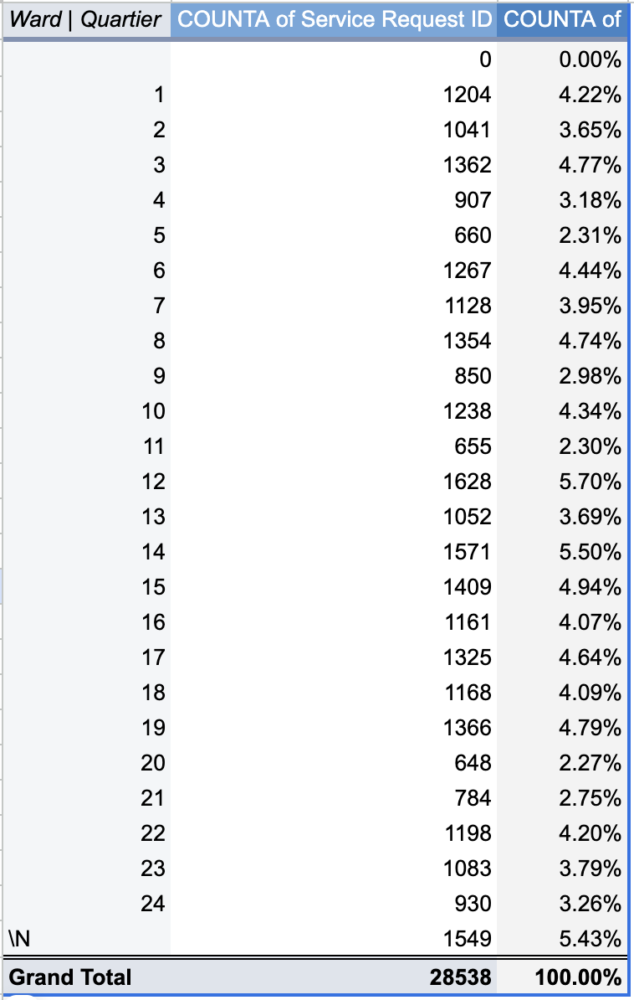
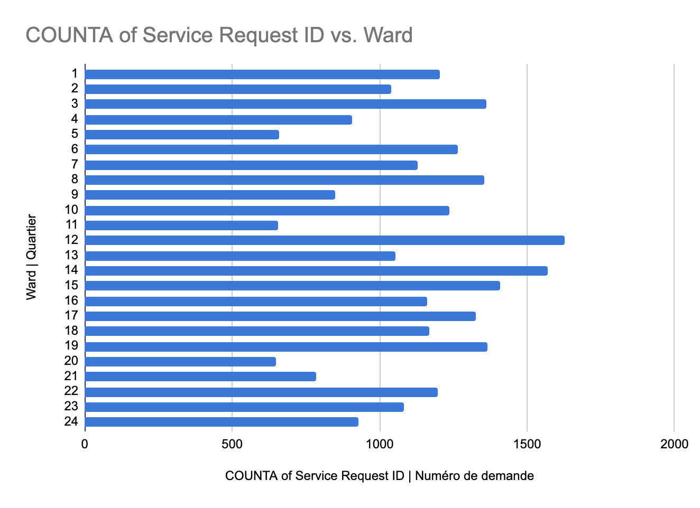

**November 4 2024**<br>
**MPAD2003A Introductory Data Storytelling**<br>
**Noor Choudhry**<br>
**Presented to Jean-Sébastien Marier**<br>

# Midterm Project: Exploratory Data Analysis (EDA)
<!---
## Foreword

For this assignment, you must extract data from a dataset provided by the instructor. You must then clean and analyze the data, create exploratory charts/visualizations, and find a potential story idea. Your assignment must clearly detail your process. You are expected to write about 1500-2000 words, and to include several screen captures showing the different steps you went through. Your assignment must be written with the Markdown format and submitted on GitHub Classroom.

I have been assigning different versions of this project to my digital journalism and data storytelling students for a few years now. Its structure was inspired by the main sections/chapters of [*The Data Journalism Handbook*](https://datajournalism.com/read/handbook/one/). This version was further inspired by the [Key Capabilities in Data Science](https://extendedlearning.ubc.ca/programs/key-capabilities-data-science) program offered by the University of British Columbia (UBC).

**Here are some useful resources for this assignment:**

* [GitHub's *Basic writing and formatting syntax* page](https://docs.github.com/en/get-started/writing-on-github/getting-started-with-writing-and-formatting-on-github/basic-writing-and-formatting-syntax)
* [The template repository for this assignment in case you delete something by mistake](https://github.com/jsmarier/jou4100_jou4500_mpad2003_project2_template)

Did you notice how to create a hyperlink? In Markdown, we put the clickable text between square brackets and the actual URL between parentheses.

And to create an unordered list, we simply put a star (`*`) before each item.

Use two hashtag symbols (`##`) to create a level 2 heading like this one.

To include a screen capture, use the sample code below. Your images should be saved in the same folder as your `.md` file.


<br>
*Figure 1: The "Import file" prompt on Google Sheets with the correct settings selected.*

**Here are examples of functions and lines of code put in grey boxes:**

1. If you name a function, put it between "angled" quotation marks like this: `IMPORTHTML`.
1. If you want to include the entire line of code, do the same thing, albeit with your entire code: `=IMPORTHTML("https://en.wikipedia.org/wiki/China"; "table", 5)`.
1. Alternatively, you can put your code in an independent box using the template below:

``` r
=IMPORTHTML("https://en.wikipedia.org/wiki/China"; "table", 5)
```
This also shows how to create an ordered list. Simply put `1.` before each item.
-->

## 1. Introduction

The purpose of this analysis is to explore a dataset from the City of Ottawa that documents a range of service requests submitted by residents during August 2024. The dataset encompasses various fields, including request type, description, status, opening and closing dates, address, and ward. This collection covers the city's public service responses across various regions, offering insights into service delivery and community needs.

I will **gather data** from the service request records of Ottawa and **investigate** it using a *VIMO analysis*, followed by *data cleaning* and a thorough *Exploratory Data Analysis* (EDA) to uncover trends and insights. Finally, I will use these insights to create visuals and build a **brief narrative** about service patterns across the city.

For the original dataset, [click here](https://open.ottawa.ca/documents/65fe42e2502d442b8a774fd3d954cac5/about). If you're interested in downloading the CSV file from Professor Jean-Sébastien Marier's GitHub page, you can [click here](https://raw.githubusercontent.com/jsmarier/course-datasets/refs/heads/main/ottawa-311-service-requests-august-2024.csv).

**Or copy and paste these links into your browser:**

Original dataset: https://open.ottawa.ca/documents/65fe42e2502d442b8a774fd3d954cac5/about 

CSV file:
https://raw.githubusercontent.com/jsmarier/course-

## 2. Getting Data

To import data into Google Sheets, download the CSV file using Professor Jean-Sébastien Marier's GitHub link to the CSV file ([click here](https://raw.githubusercontent.com/jsmarier/course-datasets/refs/heads/main/ottawa-311-service-requests-august-2024.csv)). I used the drag-and-drop feature on my MacBook to upload the CSV file onto Google Sheets. Alternatively, you can go through the following steps: select **File > Import > Upload > Select a file from your device**. In the import settings, select **Replace current sheet** for "Import location" and use a **comma** as the "Separator type" to get a proper column display. The dataset consists of 10 columns and approximately 29,000 rows (28,539 to be exact).

<br>
*Figure 1: The "Import file" prompt on Google Sheets.*

[Click here for my public link to the dataset on Google Sheets.](https://docs.google.com/spreadsheets/d/18Z9AKnIkgHHDtc3c6YVl4Flks-yFMDA5r0NuCJRX324/edit?usp=sharing)

Or copy & paste this link into your browser: https://docs.google.com/spreadsheets/d/18Z9AKnIkgHHDtc3c6YVl4Flks-yFMDA5r0NuCJRX324/edit?usp=sharing


<br>
*Figure 2: Screen capture of my dataset in Google Sheets.*

### Observations of Key Columns

- **Status** (column B): A nominal (categorical) variable that shows the status of each request (options include: Active, Resolved, and Cancelled).
- **Opened Date and Closed Date** (columns E & F): These two are fields that can help analyze the duration of each request.
- **Ward** (column J): A discrete numerical variable that helps with th geographic analysis of requests across the city.

### General Observations

Some columns, such as **Address**, **Latitude**, and **Longitude**, have missing values, which could affect location-based analyses. The data appears clean in terms of categorical organization, but with so many rows, readability can be challenging. The dataset is well-organized by columns, but given the volume of entries, it will be difficult to analyze on its own.

### Hypothesis/Question

A question that comes to mind for this data involves "what is the possible correlation between **ward** and **service requests**." Specifically, I am interested in looking into the relationship between ward and **status, quantity**, and **type** of requests. Understanding this correlation could reveal patterns that could lead to a better resource allocation and improve community services. By analyzing the data across different wards, we may identify areas that require more attention or different service strategies.


## 3. Understanding Data

### 3.1. VIMO Analysis


A VIMO analysis has an important role in understanding data. The acronym stands for **Valid, Invalid, Missing, Outliers**. Each of these categories helps in identifying the quality and integrity of the data being analyzed. By categorizing data this way, we can make informed decisions on how to clean and interpret their datasets effectively. The Government of Canada explains the importance of data accuracy in the following quote. "Accuracy is one of the six dimensions of Data Quality used at Statistics Canada. Accurate data correctly describe the phenomena they were designed to measure or represent." (Government of Canada, Statistics Canada, 2022)


This VIMO analysis will focus on three columns: **Status** (Column B), **Opened Date** (Column E), and **Closed Date** (Column F).

#### 1. Validity

- **Status**: The **Status** column should contain only three values: *Active*, *Resolved*, and *Cancelled*. These statuses show the progress or completion of service requests and must match each record's actual state.
  - *Observation*: All rows have one of the three valid statuses, besides the column title, confirming the data's validity.

- **Opened Date and Closed Date**: These fields show when a request was submitted and closed. Dates must be in the correct format (e.g., YYYY-MM-DD) and in chronological order, meaning the **Closed Date** can't be earlier than the **Opened Date**.
  - *Condition*: A closed date should only be missing if the status is marked *Active*.


#### 2. Invalidity

- **Status**: If **Status** has any entries that are notin the *Active*, *Resolved*, or *Cancelled* categories, they are considered invalid.
  - *Example*: Entries that would say "In Progress" or "Done" would be invalid since they don't match the acceptable options.
  - *Observation*: All entries in this column are valid.

- **Opened Date and Closed Date**: Like I wrote above for validity, entries that dont match the standard format (e.g., YYYY-MM-DD) or places where **Closed Date** is earlier than **Opened Date** are invalid.
  - *Observation*: The data appears fine with no invalid entries.


#### 3. Missing Values

- **Status**: Missing values could affect the summary of request outcomes, as each request should have a clear status.
  - *Observation*: All values in the status column are accounted for.

- **Opened Date and Closed Date**: Missing **Opened Dates** hinder tracking the start of service requests, and a "Resolved" request missing a **Closed Date** raises concerns about data accuracy and the timing of resolution.
  - *Observation*: All Opened Date values are accounted for, and while some Closed Date entries are marked "\N", those most ikely have an active status.


#### 4. Outliers

- **Status**: Since **Status** is categorical, it won't usually have outliers. However, if there are significantly fewer "Cancelled" statuses compared to "Resolved" or "Active," this imbalance could be worth exploring.

- **Opened Date and Closed Date**: Long gaps between **Opened Date** and **Closed Date** may suggest service delays or data entry errors, while same-day open and closing might also be unusual.
  - *Observation*: Reviewing these intervals could reveal unusual delays or patterns worth looking into.

---
### 3.2. Cleaning Data

#### Method 1: Removing Whitespace with Google Sheets Trim Tool

Whitespace can often cause issues with sorting, filtering, and data consistency. To clean my dataset, I used Google Sheets’ built-in Trim Whitespace tool.

Steps:
1. I selected the entire dataset by clicking on the top-left corner of my Google Sheet.
2. Navigated to **Data > Data cleanup > Trim whitespace**.
3. I automatically removed extra spaces before and after each cell value, keeping only the necessary text.

The data was cleaner, with uniform values in each cell. The **Status** column seemed to have the most trailing spaces, so now it would be much easier to work with.


#### Method 2: Removing Duplicates

Duplicate entries can skew results by making it seem like certain requests appear more frequently than they do. I removed duplicates using Google Sheet's Remove Duplicates feature.

Steps:
1. I selected the entire dataset by clicking on the top-left corner of my Google Sheet.
2. Navigated to **Data > Data cleanup > Remove duplicates**.
3. In the popup, I made sure that all columns were selected so each entry was evaluated as a unique record.
4. Clicked **Remove duplicates** to complete the process.

It turns out that there were no duplicates in the data, but it's always good to make sure for accuracy.


#### Method 3: Splitting Data in the Description Column with SPLIT Function

The **Description** column entries included both English and French phrases separated by a “|” symbol. To make it easier to work with, I split this column into separate English and French description columns using the `SPLIT` function.

Steps:
1. In a new column (I used column L), I entered the following formula in the space **L2**:
   ```markdown
   =SPLIT(D2, "|")
2. I then selected the box and I copied the formula down the column to apply it to all rows.

I now have a distinct English and French description columns, which makes it easier to do text-based analysis on the data.

<br>
*Figure 3: This is a screenshot of the google sheet data post-clean-up*

---
### 3.3. Exploratory Data Analysis (EDA)

I selected **Ward** and **Service Request ID** as the key variables to investigate whether the frequency of service requests differs by area. This insight could help reveal geographic trends in city services and identify areas with higher or lower service demands.

<br>
*Figure 4: This pivot table shows each ward and the amount of service requests there are, as well as a percentage*

<br>
*Figure 5: This exploratory chart shows the ward number vs. the amount of service request ID's*

#### Key Findings
The pivot table shows which wards submit the most requests. For example, **Wards 12 and 14** have the highest request counts, it could mean that these areas need more attention or resources.

#### Insights and Next Steps
The high number of requests in some wards may indicate specific needs, so services should allocate resources in those areas to help reduce the numbers.
Further analysis could identify which types of requests are more common in high-request wards, clarifying service demand patterns. 
This EDA provides a basic understanding of service distribution in the city and identifies areas where management may need to allocate more resources.

I would like to learn how to create a chart or pivot table (whichever format is more suitable) that effectively illustrates the different **types of requests** coming from each ward.


## 4. Potential Story

This analysis can reveal the story of how city service requests reflect varying needs across Ottawa's wards. Analyzing which wards make the most service requests can reveal connections between population density, community resources, and service needs. Through this story, we can explore questions like: "Are there specific services that are more frequently requested in certain wards?" and "how can we lower service requests in high-request areas?" Additional data on ward population, median income, and other demographics would help illustrate this story. This could help us analyze whether socioeconomic factors contribute to higher service requests.
I can think of two interviewees for this story. One, City of Ottawa officials, for insights on current resource allocation and service response strategies across different wards. And two, Community leaders from high-request wards, for their perspective on local needs and feedback from residents.

To learn more about these topics, I would look for news articles on service delivery and public infrastructure needs in Ottawa. Studies on urban demographics and service demand (e.g., reports from Ottawa’s Planning, Real Estate, and Economic Development Department). Consider looking into government publications on city services and funding allocations for different wards, and compare those findings with interviews with Ottawa officials.


## 5. Conclusion

Throughout this project, I aimed to analyze the City of Ottawa's service requests dataset from August 2024 to uncover patterns in community needs across wards. My process included importing, cleaning, and performing an exploratory data analysis (EDA) to examine trends. This was not without challenges; handling a large dataset in Google Sheets presented limitations in both processing speed and complexity, while ensuring data integrity required thorough checks for validity and consistency. This time, I couldn't identify inconsistencies in the data as I usually do (physically looking at the dataset), because there was too much information to process. The most interesting part of this project was learning about service patterns across Ottawa’s wards. I was completely unaware of how service requests are collected in Ottawa and the volume of requests collected in just one month. I see the need to improve my analytical skills, particularly in statistical methods, and I want to explore more advanced tools for future projects. Adding variables like population density would improve the analysis and better explain service needs in various wards. This project improved my data storytelling skills and emphasized the significance of clean data and structured analysis for producing meaningful results.

## 6. References

Include a list of your references here. Please follow [APA guidelines for references](https://apastyle.apa.org/style-grammar-guidelines/references). Hanging paragraphs aren't required though.


- Government of Canada, Statistics Canada. (2022, May 11). Data Accuracy and Validation: Methods to ensure the quality of data. Retrieved from [https://www.statcan.gc.ca/en/wtc/data-literacy/catalogue/892000062020008](https://www.statcan.gc.ca/en/wtc/data-literacy/catalogue/892000062020008 )

- I did try to use chatGPT to help formatting my VIMO analysis, because of the point form list format I was going for but it slightly changed my words which I caught (thankfully) and made those corrections in my 10th commit. thankfully I wrote my rough draft in a [google doc](https://docs.google.com/document/d/1xwY8FLaS1buSC6-B8Yj_dgrjjJ4vgUo6FsffeNEyA7M/edit?usp=sharing) so I just had to copy and paste my original text. [https://docs.google.com/document/d/1xwY8FLaS1buSC6-B8Yj_dgrjjJ4vgUo6FsffeNEyA7M/edit?usp=sharing](https://docs.google.com/document/d/1xwY8FLaS1buSC6-B8Yj_dgrjjJ4vgUo6FsffeNEyA7M/edit?usp=sharing)

- Also I'd like to note I faced some difficulty where my commits were not pushing until I did troubleshooting and typed a command in the terminal that a man named Chris from [Stack Overflow](https://stackoverflow.com/questions/62753648/rpc-failed-http-400-curl-22-the-requested-url-returned-error-400-bad-request) suggested:
``` r
 git config http.postBuffer 524288000

git pull && git push
``` 
[https://stackoverflow.com/questions/62753648/rpc-failed-http-400-curl-22-the-requested-url-returned-error-400-bad-request](https://stackoverflow.com/questions/62753648/rpc-failed-http-400-curl-22-the-requested-url-returned-error-400-bad-request)